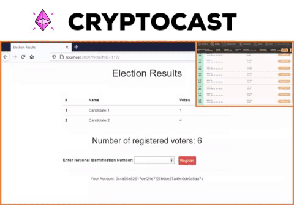

# CryptoCast - Blockchain Based Secure Voting System

## CryptoCast is Ethereum Blockchain based decentralized application which ensures secure and transparent voting scheme for organizing public and private elections.

## :bulb: Features
:arrow_forward: **Secure Voter Registration**  
:arrow_forward: **Ballot Signing Support For Election Authority**  
:arrow_forward: **Tamper-proof Ballots**  
:arrow_forward: **Double Voting Prevention**  
:arrow_forward: **Blind Signature Support using ECDSA**

## 🎯 Purpose of Blockchain Based E-Voting

### Physical election systems that are prevalent have several drawbacks -
- Ballots can be internally tampered before or after vote casting
- Election system does not ensure transparency and security
- Voters need to trust election authority
- Double voting issue can occur

### CryptoCast, being a blockchain based E-Voting solution, addresses these issues by adpoting following schemes -
- Each ballot is **cryptographically signed** using election authority's *private key*
- Ballots are **tamper-proof** as those are digitally signed and verified by **smart contract** on the blockchain.
- **Double voting** is addressed by keeping registered voters' data on Blockchain
- Election authority does not have access to voter's ballot
- Elligible voters can only register for the election with their _National Identification Number_.

## :hammer: Technology Stack
1. **Blockchain Tools**
    1. [Truffle](https://www.trufflesuite.com/)
    1. [Web3 JS](https://web3js.readthedocs.io/en/v1.2.11/)
    1. [Ganache](https://www.trufflesuite.com/ganache)
1. **Smart Contract Programming**
    1. [Solidity](https://solidity.readthedocs.io/en/v0.7.0/)
1. **Front End**
    1. [HTML](https://en.wikipedia.org/wiki/HTML/)
    1. [CSS](https://www.w3.org/Style/CSS/Overview.en.html)
    1. [Bootstrap](https://getbootstrap.com/)
    1. [JavaScript](https://www.javascript.com/)
1. **Dev Servers**
    1. [Node](https://nodejs.org/en/)
    1. [Lite-Server](https://www.npmjs.com/package/lite-server)

## :briefcase: Pre-requisites

- **Truffle** `= v5.1.10`
- **Node.js** `>= v12.18.2`
- **Solidity (Solc-js)** `= v0.4.23 `
- **Node.js** `>= v12.18.2`
- **Web3** `>= v1.2.11`

## :handshake: Contribution
Contributions are welcome!

Feel free to submit a pull request, with anything from small fixes, to full new sections. If you are writing new content, please reference the contributing page for guidance on style.
See the issues for topics that need to be covered or updated. If you have an idea you'd like to discuss, please open up an issue.

### Enabling version updates on your fork
If you wish, you can enable dependency version updates on fork.
For that, follow [this guide](https://docs.github.com/en/github/administering-a-repository/enabling-and-disabling-version-updates) to enable dependabot on your fork.  

## :gift: Resources
If you're Starting with Blockchain you can refer to :

- Blockdegeree Course Basic : https://www.blockdegree.org/blockchain-basic

- Blockdegeree Course Advanced  : https://www.blockdegree.org/blockchain-advanced

- Blockdegeree Course Proffesional : https://www.blockdegree.org/blockchain-professional

- Upgrad is offering free courses as well : https://www.upgrad.com/free-courses/

- Smart Contract Security Best Practices: https://consensys.github.io/smart-contract-best-practices/

## :star: :star: This project is a part of **SCI-2020** :star: :star:
## **OPEN SOURCE CONTEST - STUDENT CODE-IN**

### **About SCI**

**[Student Code-In](https://scodein.tech) is a global program that helps students grow with Open Source. It is a 2 months long Open-Source initiative which provides you the best platform to improve your skills and abilities by contributing to vast variety of Open Source Projects. In this, all the registered participants would get an exquisite opportunity to interact with the mentors and the Organizing Team.**

  <kbd></kbd>
  

